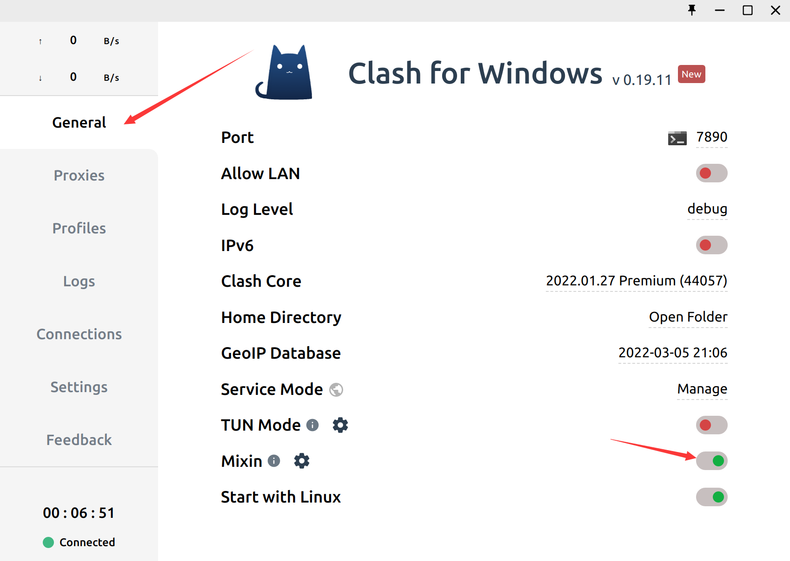

clash安装教程

1. 在当前目录输入`bash clash_install.sh ` 
2. 输入 `sudo mv ~/.app/clash/clash.desktop /usr/share/applications/`
3. 打开更多应用

4.双击打开 clash，点击 profiles 导入节点。

5.复制你购买到的订阅地址输入到输入框里，点击 Download 下载节点。

6.点击 General，打开 Mixin。

7.打开设置，找到网络接着找网络代理。

8.设置网络代理。

9.配置git

`git config --global http.proxy 'http://127.0.0.1:7890'`

`git config --global https.proxy 'https://127.0.0.1:7890'`

10.测试

`curl https://www.youtube.com/`

配置成功为快速相应
